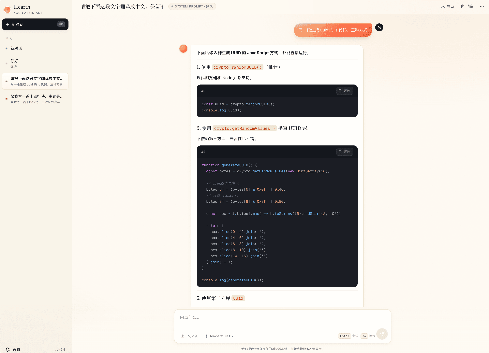
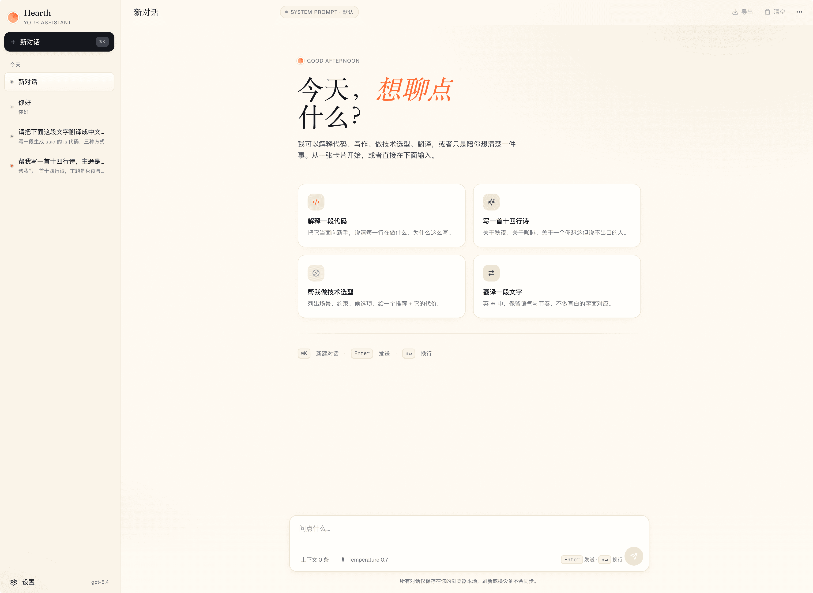
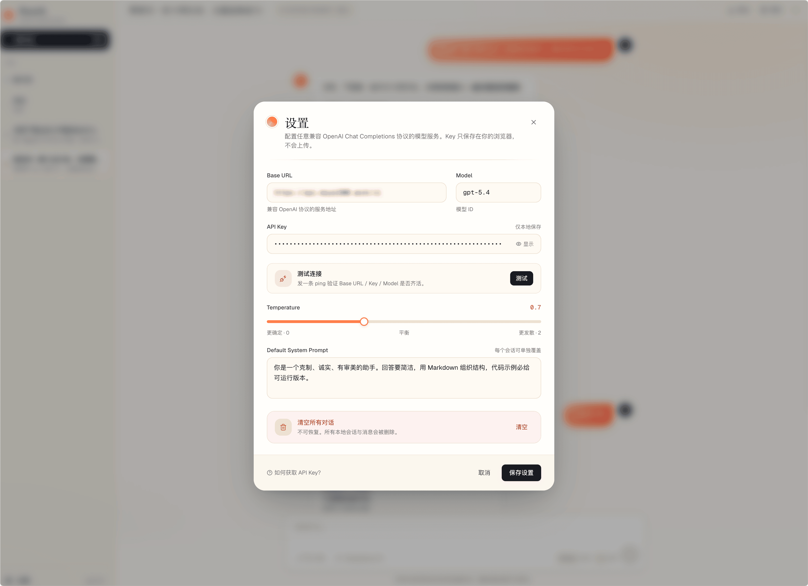
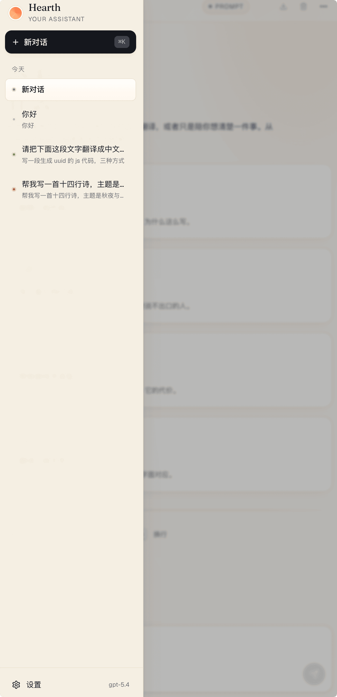

# Hearth · Your Assistant


> 一个本地优先的 AI 聊天助手——纯前端 React 应用，所有对话与配置都活在浏览器里。

类 ChatGPT 多会话体验，对接任意兼容 OpenAI Chat Completions 协议的模型服务（DeepSeek / Kimi / 通义 等都行）。视觉走"暖纸 + 烈色"风，跟典型 AI 工具的灰白冷淡划清界限。

## 界面预览

| 视图 | 截图 |
|---|---|
| **主对话**（含 Markdown 代码块） |  |
| **空状态**（首次进入引导） |  |
| **设置面板**（带"测试连接"） |  |
| **移动端抽屉** |  |

> 想直接看设计意图，可以打开 [`design/index.html`](design/index.html)——这是 React 实现之前的静态 UI 原型，包含完整的设计 token 与 4 个视图切换。

## 功能特性

**核心**

- 多会话管理（新建 / 切换 / 重命名 / 删除，按今天/本周/更早分组）
- 多轮上下文（每次请求带完整 messages）
- SSE 流式逐字输出，末尾跳动光标
- LocalStorage 持久化，刷新/重启不丢
- Markdown 渲染 + 代码块语法高亮 + 一键复制

**进阶**

- ⏹ Stop 中断生成（AbortController）
- ↻ 重新生成最后一条回复
- ✎ 编辑用户消息（自动丢弃后续并重发）
- ⤓ 导出对话为 Markdown / JSON
- 会话级 System Prompt（覆盖全局默认）
- 设置面板"测试连接"按钮，发非流式 ping 验证 Base URL/Key/Model

**体验**

- ⌘K 新建对话、⌘, 打开设置、Esc 关闭抽屉/对话框
- < 768px 自动切换为移动端抽屉布局，对话框全屏
- 暖色纸感配色 + Fraunces 衬线 + Geist 正文 + 噪点纸纹

完整功能清单（F1~F14）见 [docs/SPEC.md](docs/SPEC.md)。

## 技术栈

- **框架**：React 18 + TypeScript + Vite
- **样式**：Tailwind CSS
- **状态**：Zustand + persist 中间件
- **Markdown**：react-markdown + remark-gfm + react-syntax-highlighter
- **AI 接入**：自己写的 ~120 行 SSE 解析器，兼容 OpenAI 协议
- **CORS 解决**：Vite dev 中间件按 `X-LLM-Base-URL` 头动态代理

## 快速开始

```bash
npm install
npm run dev
```

首次启动会自动弹设置面板，填写：

- **Base URL**：如 `https://api.deepseek.com/v1`
- **Model**：如 `deepseek-chat`
- **API Key**：你自己的密钥

填完点 **测试** 按钮验证连通性（发一条非流式 ping，报告延迟与上游错误）。通过后保存设置即可对话。

> dev 阶段所有 LLM 请求都会经 Vite 中间件 `/api/llm/*` 动态代理，绕开浏览器同源限制。

## 生产部署

**推荐 Vercel**（仓库里已经带好对应的 Edge Function）：

```bash
# 任选其一
vercel              # 用 vercel CLI 部署
# 或 push 到 GitHub 后在 Vercel Dashboard "Import Project"
```

部署完成即可使用，**不需要任何额外配置**。

> Vite 项目结构内 `api/llm-proxy.ts` 是一个 Vercel Edge Function，配合 `vercel.json` 的 rewrite (`/api/llm/:path*` → `/api/llm-proxy?path=:path*`) 镜像 dev 阶段 Vite 中间件的协议（按 `X-LLM-Base-URL` 头动态转发），所以浏览器永远只调用同源 `/api/llm/*`，不会撞 CORS。详见 [docs/ARCHITECTURE.md § 五](docs/ARCHITECTURE.md)。

### 部署到其他平台

dist/ 是纯静态文件，可以丢到任意静态站点托管，但**必须自己再实现一份等价的代理**（Cloudflare Workers / Netlify Functions / Nginx 反向代理皆可）。代理协议：

- 接受 path `/api/llm/<any>`
- 读取请求头 `X-LLM-Base-URL` 决定转发目标
- 流式响应原样回传（务必边读边写，不要缓冲，否则 SSE 会断）

照着 `api/llm-proxy.ts` + `vercel.json` 翻译一遍即可。

## 项目结构

```
your-assistant/
├── api/
│   └── llm-proxy.ts      # Vercel Edge Function (生产环境代理)
├── docs/                 # SPEC / ARCHITECTURE / ROADMAP + 截图
├── design/               # 设计原型（静态 HTML）
├── src/
│   ├── App.tsx
│   ├── components/       # Sidebar / Chat / Markdown / Settings
│   ├── store/            # Zustand stores (chat + settings)
│   ├── services/         # llmClient (streamChat + testConnection)
│   ├── hooks/            # useStreamingChat / useAutoScroll
│   ├── lib/              # id, cn, exporters
│   └── types/            # Message / Conversation / Settings
├── vite.config.ts        # 含 LLM dev 代理中间件
└── tailwind.config.js    # 设计 token
```

详细分层与设计决策见 [docs/ARCHITECTURE.md](docs/ARCHITECTURE.md)。

## 隐私与数据

- 所有对话、设置（**包括 API Key**）都只存在你浏览器的 LocalStorage 里
- 没有任何后端，没有任何遥测
- 换设备 / 清浏览器数据 → 全部蒸发，自己注意备份（顶部的"导出"按钮可以单会话导出）

⚠️ 因为 Key 在浏览器明文存放，**不要把这个应用部署给多人共用**——多人共用请自己加一层后端做 Key 隔离。

## 文档

- [产品需求 SPEC.md](docs/SPEC.md)
- [架构设计 ARCHITECTURE.md](docs/ARCHITECTURE.md)
- [实现路线 ROADMAP.md](docs/ROADMAP.md)

## 致谢

- 字体：[Fraunces](https://fonts.google.com/specimen/Fraunces) (Undercase Type) · [Geist](https://vercel.com/font) (Vercel)
- 图标：[Lucide](https://lucide.dev/)
- 状态管理：[Zustand](https://github.com/pmndrs/zustand) (Poimandres)
- Markdown：[react-markdown](https://github.com/remarkjs/react-markdown) + [react-syntax-highlighter](https://github.com/react-syntax-highlighter/react-syntax-highlighter)

## 许可证

[MIT](LICENSE) © 2026 maya1900
